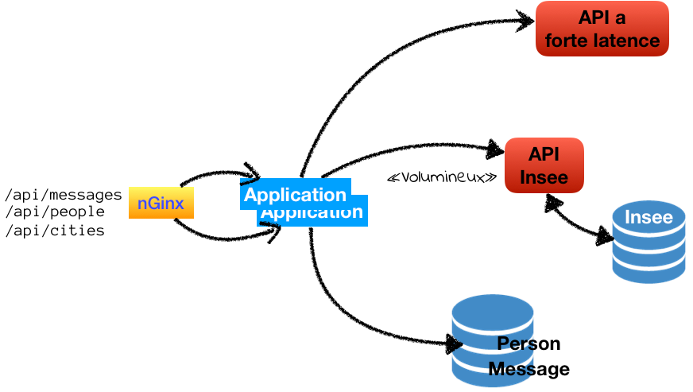
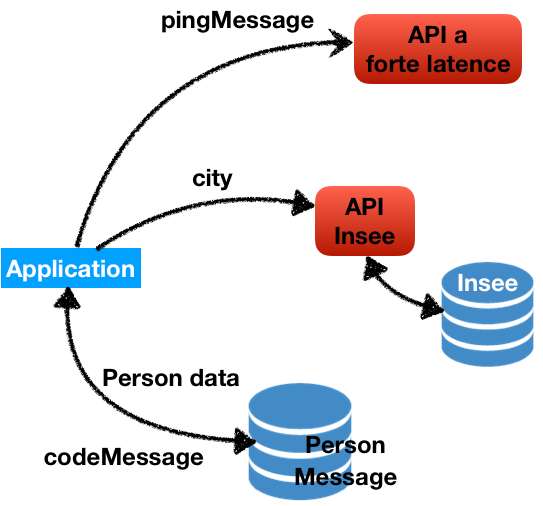

## Application exemple



-@@-

`.../api/people/toto-t`



-@@-

`.../api/people/toto-t`
```json
{
    "creator": "rogue_one",
    "created": "20181127005206",
    "modificator": "rogue_one",
    "modified": "20181127005206",
    "id": 121,
    "login": "toto-t",
    "firstname": "titi",
    "lastname": "toto",
    "cityInsee": "45234",
    "pingMessage": "Ping pour toto-t @ timestamp : 27/11/2018 - 00:52:78",
    "city": {
        "insee": "45234",
        "canton-type": "canton non précisé",
        "statut-administratif": "commune chef-lieu de région",
        "region": {
            "code": "24",
            "nom-majuscule": "CENTRE-VAL DE LOIRE"
        },
        "departement": {
            "code": "45",
            "nom-majuscule": "LOIRET"
        },
        "arrondissement-code": "2",
        "canton-code": "99",
        "nom-type": "1",
        "nom-majuscule": "ORLEANS",
        "nom": "Orléans"
    },
    "codeMessage": "Un truc vraiment louche"
}
```
