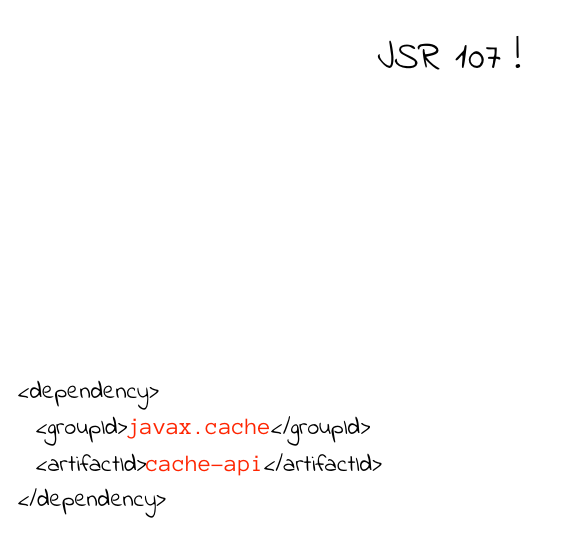

## Quand cacher ? <!-- .slide: data-background="./images/Wile_E_Coyote_09.png" data-background-size="20%" data-background-position="right bottom" -->

* Accès à la base de données <!-- .element: class="fragment" -->
* Ressource distante a forte latence <!-- .element: class="fragment" -->
* Ressource distante volumineuse <!-- .element: class="fragment" -->
* processus couteux <!-- .element: class="fragment" -->

-@@-

### Concept de cache <!-- .slide: data-background="./images/bunny_01.png" data-background-size="20%" data-background-position="left bottom" -->

notes:
Le systeme de cache de Java

-@@-

### Concept de cache <!-- .slide: data-background="./images/bunny_01.png" data-background-size="20%" data-background-position="left bottom" -->

-@@-

### Concept de cache <!-- .slide: data-background="./images/bunny_01.png" data-background-size="20%" data-background-position="left bottom" -->

-@@-

### Concept de cache <!-- .slide: data-background="./images/bunny_01.png" data-background-size="20%" data-background-position="left bottom" -->

-@@-

### Concept de cache <!-- .slide: data-background="./images/bunny_01.png" data-background-size="20%" data-background-position="left bottom" -->

-@-

<!-- .slide: data-background="./images/Wile_E_Coyote_03.png" data-background-size="15%" data-background-position="left bottom" -->
## Best practices

* Les clés doivent être immuable <!-- .element: class="fragment" -->
* Les valeurs doivent être immuable <!-- .element: class="fragment" -->
* Les caches doivent être consistant <!-- .element: class="fragment" -->
* Un cache par concept fonctionnel <!-- .element: class="fragment" -->

notes: 
Un objet en cache n'est pas accedé par une seule instance

-@@-
<!-- .slide: data-background="./images/Wile_E_Coyote_03.png" data-background-size="15%" data-background-position="left bottom" -->
## Best practices

* Objet serializable <!-- .element: class="fragment" -->
* Attention au hashcode & equals <!-- .element: class="fragment" -->
* Cacher au plus prêt de la donnée <!-- .element: class="fragment" -->
* Ne pas cacher de valeur null <!-- .element: class="fragment" -->

notes:
Au plus près de la données, idéalement avant transformation (pour les processus distant)
Pour les processus couteux ...