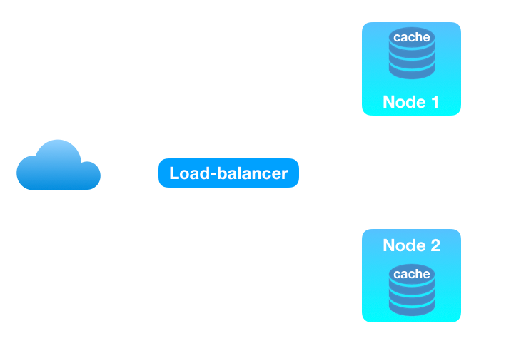
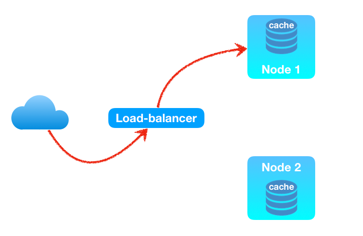
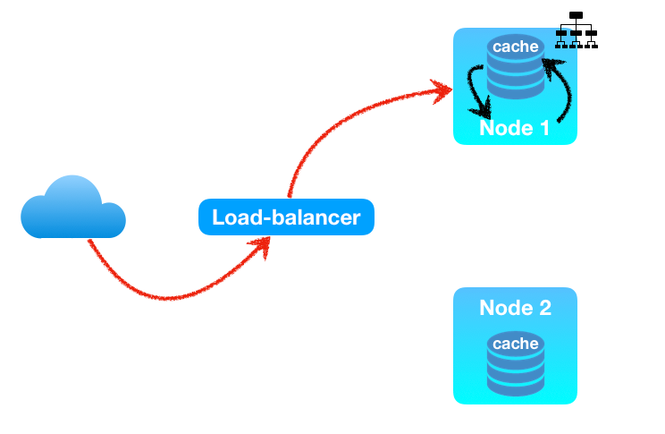
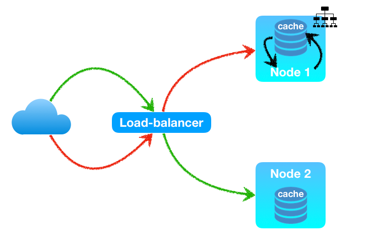
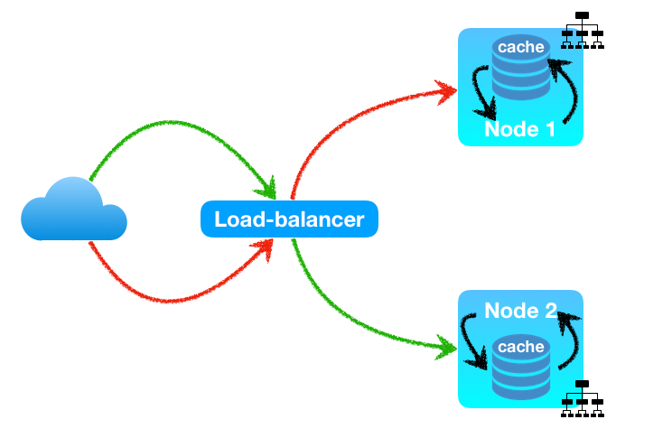
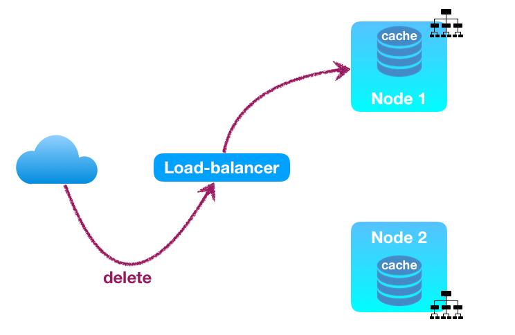
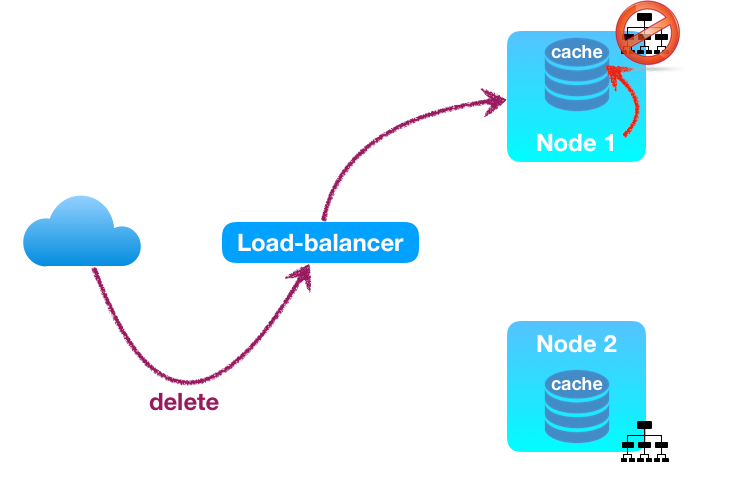
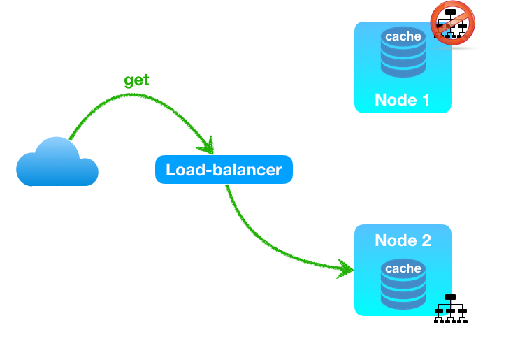
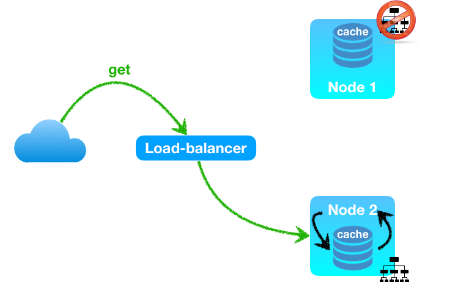

-@-

### Multi node ?

-@@-

### Multi node ?

-@@-

### Multi node ?

-@@-

### Multi node ?

-@@-

### Multi node ?

-@@-

### Multi node ?

-@@-

### Multi node ?

-@@-

### Multi node ?

-@@-

### Multi node ?

-@@-

### Multi node ?

-@@-

## Inconsistance des données

-@@-

## Solution ?

1. synchroniser les caches

-@- 

### Synchronisation des caches

Impossibilité de gérer simplement la suppression<!-- .element class="fragment" style="color: crimson;" -->

-@@- 

### Synchronisation des caches

Obligation de persistance des message d'invalidation de cache<!-- .element style="color: crimson;" -->

-@@- 

### Synchronisation des caches

La mutiplication des noeuds réduit l'efficacité du cache<!-- .element style="color: crimson;" -->

-@@-

### Synchronisation des caches

C'est la solution actuelle d'AVISé et de l'éditique

> mais ce n'est pas satisfaisant<!-- .element class="fragment" -->

-@-

## Solution ?

1. synchroniser les caches <!-- .element style="text-decoration: line-through;" -->
2. Utilisation d'un cache commun

