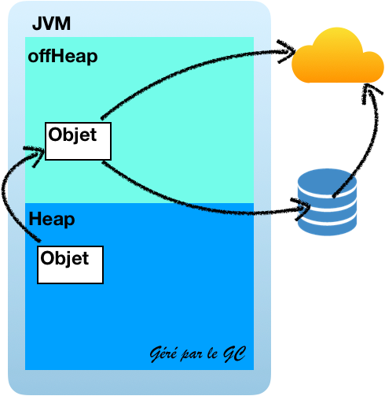

## ehCache et la mémoire

***Par défaut les objets sont dans le heap de la JVM*** 

> Pris en charge par le GC

-@@-

## ehCache et la mémoire

***Par défaut les objets sont dans le heap de la JVM*** 

> Si beaucoup d'objet sont placé dans le heap de la JVM

-@@-
<!-- .slide: data-background="./images/multi-node-inmem-10.png" -->

-@@-

## ehCache et la mémoire

*ehCache permet la gestion hors heap*

> Big memory <!-- .element class="fragment" -->

-@@-

## ehCache et débordement

*ou aussi appelé gestion par tiers*

* Off-heap
* Disque
* Serveur distant

> non exclusif 


-@@-

## ehCache big memory



-@@-

## ehCache big memory

```xml
<cache-template name="app-default">
    <expiry>
        <ttl unit="seconds">30</ttl>
    </expiry>
    <resources>
        <heap>10</heap>
        <offheap unit="MB">1</offheap>
    </resources>
</cache-template>
```
> Notion de ressources

notes:
Expliquer que les accès les plus fréquent se situe au niveau de heap...

-@@-

## ehCache big memory

```xml
<cache-template name="app-default">
    <expiry>
        <ttl unit="seconds">30</ttl>
    </expiry>
    <resources>
        <heap>10</heap>
        <offheap unit="MB">1</offheap>
        <disk unit="GB">1</disk>
    </resources>
</cache-template>
```
> ajout d'un tier de stockage sur le disque

-@@-

## ehCache big memory

```xml
<cache-template name="app-default">
    <expiry>
        <ttl unit="seconds">30</ttl>
    </expiry>
    <resources>
        <heap>10</heap>
        <offheap unit="MB">1</offheap>
        <disk unit="GB" persistent="true">1</disk>
    </resources>
</cache-template>
```
> ajout d'un tier de stockage sur le disque "persistant"

notes:
Le fait de rendre le stockage disque persistant permet de retrouver les données mise en cache au reboot de l'application
