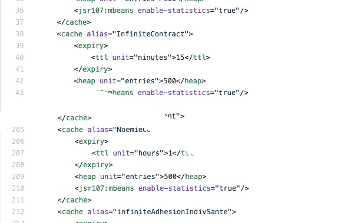

> Plusieurs cache avec des configuration identiques

-@@-
<!-- .slide: data-background="./images/Wile_E_Coyote_10.png" data-background-size="20%" data-background-position="right 2.5em top 1em" -->

> Empilement de cache



> 250 lignes !!!

-@@-

### Cache template

```xml
<cache-template name="mainapp-default">
    <expiry>
        <ttl unit="seconds">30</ttl>
    </expiry>
    <heap unit="entries">10</heap>
</cache-template>
...


...
```

-@@-
<!-- .slide: data-background="./images/bunny_01.png" data-background-size="20%" data-background-position="left bottom" -->

### Cache template 

```xml
<cache-template name="mainapp-default">
    <expiry>
        <ttl unit="seconds">30</ttl>
    </expiry>
    <heap unit="entries">10</heap>
</cache-template>
...
<cache alias="messages" uses-template="mainapp-default"/>
<cache alias="people" uses-template="mainapp-default"/>
...
```

-@@-
<!-- .slide: data-background="./images/bunny_01.png" data-background-size="20%" data-background-position="left bottom" -->

### Cache template

* définition de plusieurs configuration par défaut
* N'empeche pas la définition unitaire
* plus de lisibilité

